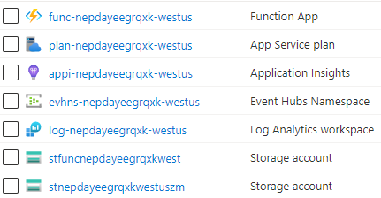
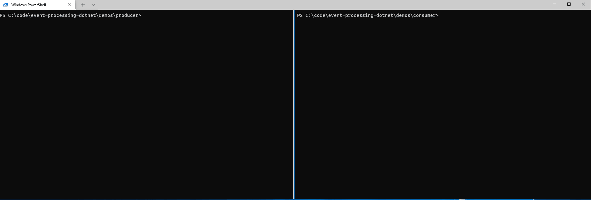
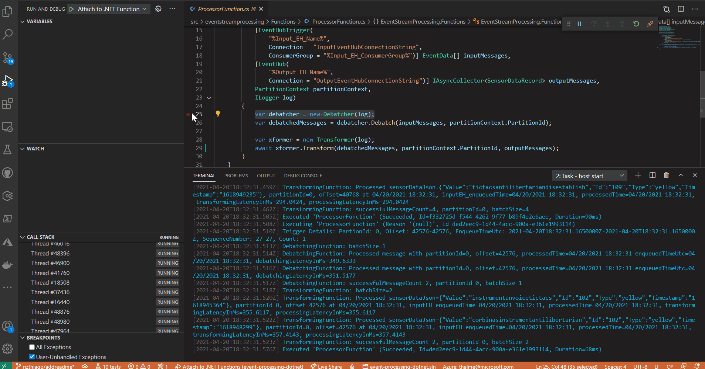

# Welcome to the Event Processing with .NET - Demo for Spark 3.0 conference

This sample implements an Azure Function written in .NET. The Function dequeues sensor data in XML format from an Azure Event Hub, filters, augments, debatches, and transforms them to JSON, and enqueues them on another Event Hub.

## Quick Overview

A popular approach for an end-to-end event stream processing solution on Azure includes using the Event Hubs streaming service to receive events, and then process the events with highly scalable, Azure Event Hub-triggered Azure Functions.

For separation of concern and improved throughput, this is usually implemented in multiple steps: for example, an initial Azure Function debatches and filters data from an input Event Hub and writes individual events into a second Event Hub. Then a second Function decodes, augments, and transforms the individual events and writes them to a final data store or another Event Hub for downstream processing. This Accelerator implements both those steps in one Azure Function for simplification. It transforms and filters events from the incoming XML formated telemetry events, converts and augments the filtered events into JSON, and writes each JSON event to a second Event Hub.


The filtering in the first event is done based on a specific sensor type, defined by the `SENSOR_TYPE` app setting. The augmentation adds information about enqueue times, processing time, and the partition from the input Event Hub to the outbound messages, as these are often needed for end to end processing time querying later.

Here is an example input XML:

```XML
<?xml version="1.0" encoding="utf-8"?>
<devices>
    <sensor id="103" type="yellow" timestamp="1618591656"><value>heifersIncongruousPulmotors</value></sensor>
    <sensor id="105" type="yellow" timestamp="1618593631"><value>shlepsMagnitudeSkite</value></sensor>
    <sensor id="102" type="white" timestamp="1618592572"><value>billingsUridineSplendours</value></sensor>
</devices>
```

Following this example, if the `SENSOR_TYPE` app setting was set to `yellow`, the Azure Function would filter and then generate the following two events from the above XML and send them to the output Event Hub:

Event 1:

```JSON
{"Sensor":{"Value":"heifersIncongruousPulmotors","Id":"103","Type":"yellow","Timestamp":"1618591656"},"EnqueuedTime":"2021-04-16T18:31:32.28Z","ProcessedTime":"2021-04-16T18:31:32.3497434Z","PartitionKey":"103","RowKey":"6684159d-357d-4fb5-97ea-683095aa4b60"}
```

Event 2:

```JSON
{"Sensor":{"Value":"shlepsMagnitudeSkite","Id":"105","Type":"yellow","Timestamp":"1618593631"},"EnqueuedTime":"2021-04-16T18:31:32.28Z","ProcessedTime":"2021-04-16T18:31:32.3497434Z","PartitionKey":"107","RowKey":"6684159d-357d-4fb5-97ea-683095aa4b60"}
```

### The Function

This project has a single [Azure Function](event-processing-dotnet/src/eventstreamprocessing/Functions/ProcessorFunction.cs).

This Azure Function takes an array of events from an input Azure Event Hub, and calls the [Debatcher logic](event-processing-dotnet/src/eventstreamprocessing/Core/Debatcher.cs) to filter and split out the events, then calls the [Transformer logic](event-processing-dotnet/src/eventstreamprocessing/Core/Transformer.cs) to transform each telemetry entry to JSON and to add extra content to the messages. Finally, the function sends the separate filtered and transformed events to an output Azure Event Hub.

## Build and Deploy

This Accelerator requires Azure Event Hubs, so it includes bicep language templates to generate the necessary Azure components.

Create a new Resource Group on Azure and then from a Bash command line with the Azure CLI installed, browse to the `infra` folder and execute [deploy.sh](event-processing-dotnet/src/infra/deploy.sh) passing in the resource group name. This will create:

* An event hub namespace with two event hubs in it
* An Azure Function App and a new Consumption App Service Plan for it. Application settings should be all pre-configured
* An Application Insights instance for Azure Functions application logging
* A Log Analytics workspace instance for Event Hubs monitoring and raw Azure Functions logs
* A storage account used for Azure Functions
* A storage account to be used by the local Event Hubs consumer emulator



Once the deployment script is done, there will be an `outputs` section with all the values needed for local debugging.

## Local Debugging

Once the Azure assets have been created using the deploy script, you can create a new `local.settings.json` file in the `src/eventstreamprocessing` folder, and configure it with the correct values for the input and output event hubs, and the SENSOR_TYPE, from the `outputs` section of the deployment script. For example:

```JSON
{
    "IsEncrypted": false,
    "Values": {
      "AzureWebJobsStorage": "<value from azureWebJobsStorage in deployment Outputs>",
      "FUNCTIONS_WORKER_RUNTIME": "dotnet",

      "Input_EH_Name": "<value from input_EH_Name in deployment Outputs>",
      "InputEventHubConnectionString": "<value from eventHubConnectionStringListen in deployment Outputs>",
      "Input_EH_ConsumerGroup": "<value from input_EH_ConsumerGroup in deployment Outputs>",

      "Output_EH_Name": "<value from output_EH_Name in deployment Outputs>",
      "OutputEventHubConnectionString": "<value from eventHubConnectionStringSend in deployment Outputs>",

      "SENSOR_TYPE": "<value from sensoR_TYPE in deployment Outputs>"
    }
}
```

After this you can simply open the repository in Visual Studio Code with the Azure Functions extension and start [debugging](.vscode/launch.json). Codespaces debugging is also possible because the accelerator has a development environment [defined in a container (a devcontainer)](.devcontainer).

You can then send XML messages into the input event hubs to start testing the solution. There are [producer](./demos/producer) and [consumer](./demos/consumer) command line utilities provided to help. Note that both have an `appsettings.json` files to be configured. In the [Producer's configuration](./demos/producer/appsettings.json) you need the same Input Event Hub connection string and name as you configured for your Azure Function. And in the [Consumer's configuration](./demos/consumer/appsettings.json) you need the same Output Event Hub connection string and name as you configured for your Azure Function, plus the `localConsumerStorage` connection string from the `Outputs` of the deployment step.

## Testing

After creating the Azure assets using the deployment instructions and configuring the function's `local.appsetting.json`, you can update the [consumer `appsettings.json`](./demos/consumer/appsettings.json):

```JSON
{
    "EventHub": {
        "ConnectionString" : "<value from eventHubConnectionStringListen in deployment Outputs>",
        "EventHubName": "<value from output_EH_Name in deployment Outputs>"
    },
    "BlobStorage": {
        "ConnectionString": "<value from localConsumerStorage in deployment Outputs>",
        "Container": "ehprocessor"
    }
}
```

And the [producer `appsettings.json`](./demos/producer/appsettings.json):

```JSON
{
    "EventHub": {
        "ConnectionString" : "<value from eventHubConnectionStringSend in deployment Outputs>",
        "EventHubName": "<value from input_EH_Name in deployment Outputs>"
    }
}
```

Now you are ready to run a test. Start debugging the Azure Function, and then start the consumer and producer from their own folders using `dotnet run`. Once producer is started it will ask for the number of batches to send and how many events in each batch:



You should also see your Azure Function in VS Code executing:


